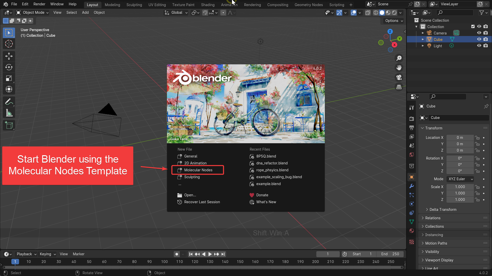
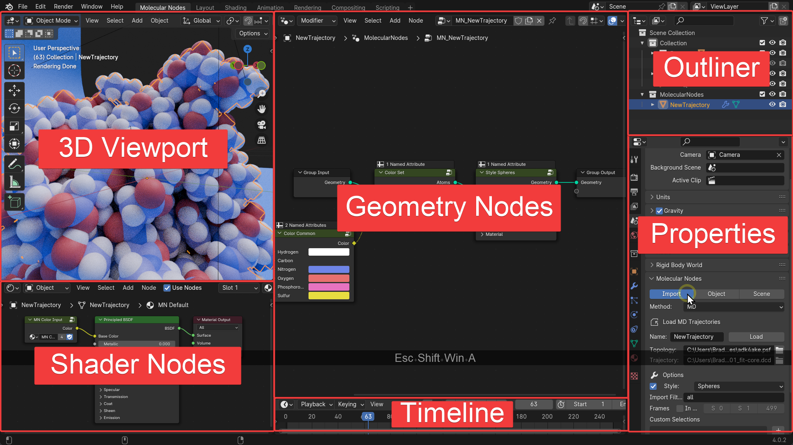

# Starting Blender

If you have successfully installed Molecular Nodes, then you should see `Molecular Nodes` as a new starting template when opening Blender.
You can still use Molecular Nodes without starting as a template, but the UI will be slightly different to start with.
When starting with or without the template, you can customise the UI and starting scene to your liking - and even create your own templates.
Included with Molecular Nodes is a template which includes a number of quality-of-life improvements for using Molecular Nodes.

If you do not see this, then please follow the [installation instructions](https://bradyajohnston.github.io/MolecularNodes/installation.html) in the documentation.



# The 'Molecular Nodes' Interface

Blender can have a very overwhelming interface.
The Molecular Nodes template starts with 3 main areas shown - the 3D viewport where the 3D view and rendered view are shown, the Geometry Nodes - where you combine different nodes to style and animate your structure, and the Shader Nodes, where you can quickly adjust the look of the materials applied to your structure.

The other areas are the `Outliner` which shows all of the objects in your 3D scene, the `Properties` where you can adjust all of the scene, render, world, material and other properties, and the `Timeline`, which shows the current and surrounding frames if there is an animation to play back.



> Where you mouse is currently hovering over, determines the actions that are triggered by keyboard shortcuts.
> Be sure to move the mouse to the area you want to interact with before using keyboard shortcuts.

You can resize and change the arrangement of the windows by hovering your mouse over the edges of the windows.
You can create new windows by dragging out of the corners of the windows, or combine windows by dragging the corner of one window into another.

> For a more general introduction to Blender, please see the [Blender's Interface](https://bradyajohnston.github.io/MolecularNodes/tutorials/00_interface.html)

## MD Trajectory Panel

To import trajectories, change the import method in the Molecular Nodes panel to the `MD` import method.

1.  Change the import method from PDB to MD
2.  Select the topology and trajectory files.

Optionally change import settings for style filtering and the addition of extra selections.
Check the documentation for more details on these potential options.


### Import Options

Before importing, we can change some of the import settings to be applied on import.
More detail on each option is further in this tutorial, but the short descriptions:

-   `Style` Tick box whether to set up nodes to apply a style, or just import the data. If enabled, a default style to be applied on import is selected. This can be changed easily after import.
-   `Import Filter` a MDAnalysis [selection string](https://userguide.mdanalysis.org/stable/selections.html) to filter the topology when importing. Default is to import everything, but you can input strings such as 'protein' to only import the protein component.
-   `In Memory` Whether to load the selected frames (from `start` to `stop`, incrementing by `step`) into memory and discard the MDAnalysis session when importing. Default is false and streams the trajectory from disk.
-   `Custom Selections` Users can create multiple custom selections that appear as boolean attributes on the imported trajectory. Useful for creating groups using MDAnalysis [selection strings](https://userguide.mdanalysis.org/stable/selections.html) to then utilise inside of the created node tree.

## Import the Trajectory

Click `Load` to import the selected trajectory with the chosen options.
The model will appear in the scene, and once you change frame in the scene, it will update the frame displayed in the viewport.


https://github.com/BradyAJohnston/MDAnalysisWorkshop-Intro0.5Day/assets/36021261/e7b58652-a83c-4bd5-bd7d-5b110adb79b7

### Changing Style

You can change the style by altering the `Style` nodes that are use inside of the node tree.

As you can see in the example, if we don't apply the style, we can view just the raw atomic data that is being updated.
Depending on which nodes we use to process that data, we can create different styles of further animations.

https://github.com/BradyAJohnston/MDAnalysisWorkshop-Intro0.5Day/assets/36021261/1b0e1273-9bf2-44c6-95a7-9edf933807b8


### Subframes

By default, each frame on the timeline matches directly with the frames in the loaded trajectory.

You can add `subframes` which then tell Blender to add additional frames in between, which linearly interpolate between positions.
This can slow down the animation and sometimes make it easier to view.
The subframes for the trajectory can be adjusted in the `Object` section of the Molecular Nodes panel.

The `Frame` number in Blender no longer directly matches the frame displayed from the trajectory, with the trajectory playing back 'slower' than previously.


## Streaming vs In Memory

### Streaming

The default option will associate an `MDAnlaysis` session with the read topology file.
This will stream the topology from disk, as the frame in the scene inside of Blender changes.
If the original topology or trajectory files are moved, this will break the connection to the data.
This is the most performant option, but will potentially break if changing computers.

Below is an example of importing a trajectory, by streaming the frames.
As the frame changes in the scene, the loaded frame is updated on the imported protein, based on the created MDAnalysis session.
Interpolation between frames is currently not supported with this import method.

The MDAnalysis session will be saved when the `.blend` file is saved, and should be restored when the `.blend` file is reopened.


### In Memory

The `In Memory` option will load all frames of the trajectory in to memory, and store them as objects inside of the `MN_data` collection in the scene.
This will ensure that all of the associated data is stored inside of the `.blend` file for portability, but will come at the cost of performance for very large trajectories.
It also breaks the connection to the underlying `MDAnalysis` session, which limits the ability to further tweak the trajectory after import.

If `In Memory` is selected, the frames are imported as individual objects and stored in a `MN_data` collection.
The interpolation between frames is then handled by nodes inside of Geometry Nodes, which aren't necessarily linked to the scene frame.

This will create a larger `.blend` file and can lead to some performance drops with large trajectories, but ensures all of the data is kept within the saved file, and can enable further creative control through Geometry Nodes.

All connection to the underlying MDAnalysis session is lost on import, and the selections and trajectory cannot changed.
To make changes you must reimport the trajectory.


## Creating the Animation

To create an animation of the structure opening, we will import one of the example datasets that we have been working with in the previous jupyter notebooks.

The data should already be downloaded onto your computer, found in your home folder under `~/MDAnalysis_data/`.
You can check the path of the files by running this command in one of your notebooks.

``` python
# pip install MDAnalysisData
from MDAnalysisData import datasets
data.fetch_adk_transitions_DIMS()
```

### Loading the Trajectory

We will load the trajectory, and load all of the frames into memory to ensure we can make a smoother trajectory.

In the video below we have imported the trajectory, and we can adjust the number of frames in the scene, as well as the number of frames the trajectory will play back over.
We also enabled `EEVEE` atoms to display in the EEVEE render engine.


#### Changing Styles

We can change the style of the imported trajectory, by adding a new style node.
We can combine styles with the `Join Geometry`.
For more details on adding styles, see the (importing)\[01_importing.qmd\] tutorial.


We can apply the atoms style, only to the side chains of the protein, by using the `Backbone` selection node, and using the `is_side_chain` output.
This selectively applies the style to only those atoms in the selection.
The combined styles now contain only the atoms for the side chains and a continuous ribbon for the protein.


### Setting the Scene

We can set up the scene a bit nicer with a backdrop.
In this case we create a plane using <kbd>Shift</kbd> + <Kbd>A</kbd> to add a plane, go in to [edit mode](#01-introduction-edit-mode) and extrude the backbdrop up with the <kbd>E</kbd> key.
We can create a slightly curved corner by bevelling the corner.
Select the two vertices of the edge and click <kbd>Ctrl</kbd> + <kbd>B</kbd>.
Move the mouse and use the scroll wheel to adjust the settings, then left click to apply.


### Rendering the Animation

We can change some final settings of the style, do a test `Render Image`, change the export settings for where the frames of the animation are going to be saved, then we can click `Render Animation` to render all of the frames of the animation.


