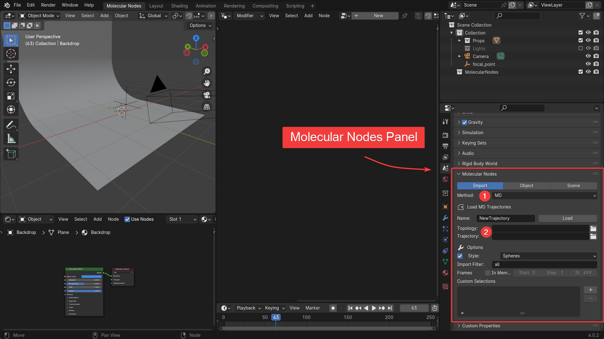
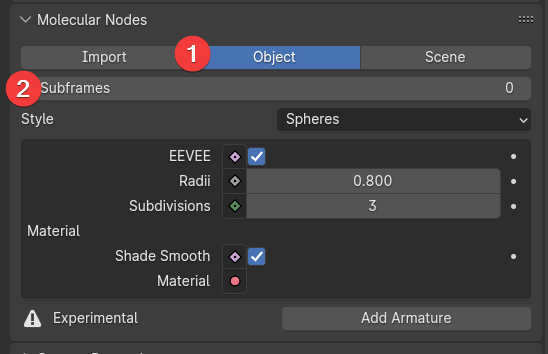
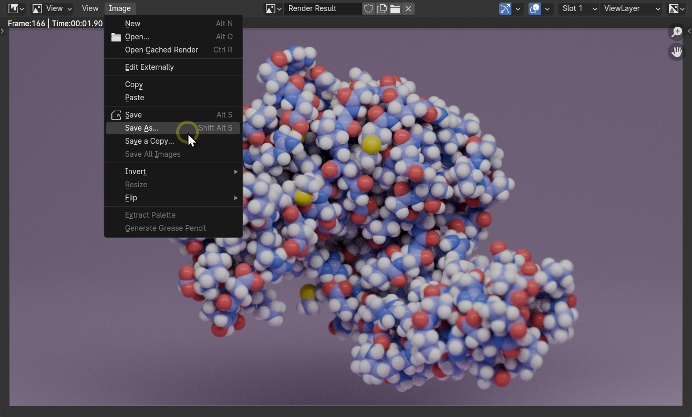

# Starting Blender

If you have successfully installed Molecular Nodes, then you should see `Molecular Nodes` as a new starting template when opening Blender.
You can still use Molecular Nodes without starting as a template, but the UI will be slightly different to start with.
When starting with or without the template, you can customise the UI and starting scene to your liking - and even create your own templates.
Included with Molecular Nodes is a template which includes a number of quality-of-life improvements for using Molecular Nodes.

If you do not see this, then please follow the [installation instructions](https://bradyajohnston.github.io/MolecularNodes/installation.html) in the documentation.


# The 'Molecular Nodes' Interface

Blender can have a very overwhelming interface.
The Molecular Nodes template starts with 3 main areas shown - the 3D viewport where the 3D view and rendered view are shown, the Geometry Nodes - where you combine different nodes to style and animate your structure, and the Shader Nodes, where you can quickly adjust the look of the materials applied to your structure.

The other areas are the `Outliner` which shows all of the objects in your 3D scene, the `Properties` where you can adjust all of the scene, render, world, material and other properties, and the `Timeline`, which shows the current and surrounding frames if there is an animation to play back.


> Where you mouse is currently hovering over, determines the actions that are triggered by keyboard shortcuts.
> Be sure to move the mouse to the area you want to interact with before using keyboard shortcuts.

You can resize and change the arrangement of the windows by hovering your mouse over the edges of the windows.
You can create new windows by dragging out of the corners of the windows, or combine windows by dragging the corner of one window into another.

> For a more general introduction to Blender, please see the [Blender's Interface](https://bradyajohnston.github.io/MolecularNodes/tutorials/00_interface.html)

## MD Trajectory Panel

To create an animation of the structure opening, we will import one of the example datasets that we have been working with in the previous jupyter notebooks.

The data should already be downloaded onto your computer, found in your home folder under `~/MDAnalysis_data/`.
You can check the path of the files by running this command in one of your notebooks.

``` python
# pip install MDAnalysisData
from MDAnalysisData import datasets
data.fetch_adk_transitions_DIMS()
```

To import trajectories, change the import method in the Molecular Nodes panel to the `MD` import method.

1.  Change the import method from PDB to MD
2.  Select the topology and trajectory files.

Optionally change import settings for style filtering and the addition of extra selections.
Check the documentation for more details on these potential options.



### Import Options

Before importing, we can change some of the import settings to be applied on import.
More detail on each option is further in this tutorial, but the short descriptions:

-   `Style` Tick box whether to set up nodes to apply a style, or just import the data. If enabled, a default style to be applied on import is selected. This can be changed easily after import.
-   `Import Filter` a MDAnalysis [selection string](https://userguide.mdanalysis.org/stable/selections.html) to filter the topology when importing. Default is to import everything, but you can input strings such as 'protein' to only import the protein component.
-   `In Memory` Whether to load the selected frames (from `start` to `stop`, incrementing by `step`) into memory and discard the MDAnalysis session when importing. Default is false and streams the trajectory from disk.
-   `Custom Selections` Users can create multiple custom selections that appear as boolean attributes on the imported trajectory. Useful for creating groups using MDAnalysis [selection strings](https://userguide.mdanalysis.org/stable/selections.html) to then utilise inside of the created node tree.

## Import the Trajectory

Click `Load` to import the selected trajectory with the chosen options.
The model will appear in the scene, and once you change frame in the scene, it will update the frame displayed in the viewport.

https://github.com/BradyAJohnston/MDAnalysisWorkshop-Intro0.5Day/assets/36021261/e7b58652-a83c-4bd5-bd7d-5b110adb79b7

### Changing Style

You can change the style by altering the `Style` nodes that are use inside of the node tree.

You can add new nodes to the node tree, by using <kbd>Shift</kbd> + <kbd>A</kbd> or using the `Add` menu. You will see all of the different categories of nodes that are possible to add. Most of these are general purpose nodes for processing geometry, and are not designed with molecular data in mind. 

The `Molecular Nodes` category are all of the custom-made nodes that are included with Molecular Nodes.

When searching for nodes, you can mouse through to manually select them, or once the add menu is open, start typing to search for possible nodes to add to the node tree.

https://github.com/BradyAJohnston/MDAnalysisWorkshop-Intro0.5Day/assets/36021261/53f55969-f162-4ebb-bb92-4d8a7c372164

Inside of Blender, the atoms exist as a 3D mesh. Atoms are individual vertices and bonds between atoms are edges between those vertices. On top of these 'Atoms', we apply a `Geometry Nodes` modifier, which takes in the atomic data from the left, process it through a series of nodes, and the output goes out to the right.

In the initial node setup, Molecular Nodes has added some starting nodes. The first assigns colors to the atoms, based on their assigned element. The second node creates a `Sphere` style, which instances a sphere for each atom in the structure.

The data flows through the node graph from left to right - like water flowing through pipes. We can alter how the data is processed, by changing the inputs on the nodes themselves, which results in changes of the final created geometry.

In the example below, if we remove the style node, we can see that no style is being applied and thus the underlying atoms and bonds are visible as the only processing of the atoms that is occurring is to assign them colors.

https://github.com/BradyAJohnston/MDAnalysisWorkshop-Intro0.5Day/assets/36021261/1b0e1273-9bf2-44c6-95a7-9edf933807b8

> There is not time to go in depth in this tutorial on how node graphs work - please see the [documentation](https://bradyajohnston.github.io/MolecularNodes) for more details and tutorials.

#### Selections

Most nodes will take an optional `Selection` input. This allows you to apply an animation or a style to specific subset of atoms within the structure. 

To access the selections, use the add menu (<kbd>Shift</kbd> + <kbd>A</kbd>) and use `Molecular Nodes` -> `Selections`. We will add the `Element` selection node.

https://github.com/BradyAJohnston/MDAnalysisWorkshop-Intro0.5Day/assets/36021261/0c1d26b4-96c0-46ff-9849-ed1ad01dfc4a

You can also create selections based on other attributes. In this next example we use the `Select Backbone` to select either backbone, side chain or alpha carbon atoms.

https://github.com/BradyAJohnston/MDAnalysisWorkshop-Intro0.5Day/assets/36021261/bbba1f62-4965-4044-94e8-0be842957439

You can even combine selections with the `Boolean Math` node, to create arbitrarily complex selections.

https://github.com/BradyAJohnston/MDAnalysisWorkshop-Intro0.5Day/assets/36021261/69420456-cb26-445d-b97b-e8db8daa2529

### Subframes

By default, each frame on the timeline matches directly with the frames in the loaded trajectory.

You can add `subframes` which then tell Blender to add additional frames in between, which linearly interpolate between positions.
This can slow down the animation and sometimes make it easier to view.
The subframes for the trajectory can be adjusted in the `Object` section of the Molecular Nodes panel.

The `Frame` number in Blender no longer directly matches the frame displayed from the trajectory, with the trajectory playing back 'slower' than previously.



### Trasnforming Objects

You can move objects around the scene with the transform keys. This includes imported structures and trajectories. 
You can select objects with a left click of the mouse <kbd>LMB</kbd>, and move them around by *Grabbing* them with the <kbd>G</kbd> key.

The main actions that you use the 3D Viewport for are:

-   <kbd>G</kbd> - **Grabbing:** Moving an object around in 3D space.

-   <kbd>S</kbd> - **Scaling:** Changing the relative size of an object.

-   <kbd>R</kbd> - **Rotating:** Rotating the object in 3D space.

#### Locking to an Axis

When transforming by grabbing, rotating or scaling, you can lock the transformation to a particular axis. Click <kbd>X</kbd> / <kbd>Y</kbd> / <kbd>Z</kbd> after starting the transformation to lock it to those axes, or <kbd>Shift</kbd> + <kbd>X</kbd> / <kbd>Y</kbd> / <kbd>Z</kbd> to lock the transformation to be *perpendicular* to that axis.

https://github.com/BradyAJohnston/MDAnalysisWorkshop-Intro0.5Day/assets/36021261/4ece00a9-d992-48d5-b4ea-bb99d57ced5c


### Rendering an Image

Blender will not render an image of what you are currently seeing like most molecular software you are used to. Blender will render an image based on what the `Camera` is currently seeing. This may seem frustrating at first - but will make more sense the more you use the software and becomes far more intuitive than other methods.

To preview what the camera sees, we can click the `Camera` icon in the 3D viewport. The slightly darkened outline shows what the camera is seeing, and if `Depth of Field` is being used, you will see what is in focus and out of focus.

You can then render an image by clicking `Render` -> `Render Image`, or use the keyboard shortcut <kbd>F12</kbd>.

https://github.com/BradyAJohnston/MDAnalysisWorkshop-Intro0.5Day/assets/36021261/f1942978-d99a-4486-abc1-6b59a6ca1e40

The time it takes for the render to complete will depend a lot on how you have set up the scene, and more importantly the kind of hardware that your computer has. This is unfortunately a limiting step for many. If you have access to external computing resources such as a HPC cluster however - you can set up a scene on your local laptop, and when you are ready to render, render the image or the animation via the command line on a compute cluster.

To save the rendered image, use `Image` -> `Save As...` and the choose the desired image formats.



#### Render Engine and Render Settings

Until now we have been using the `Cycles` render engine. This is a _physically based_ ray-traced rendering engine. It is very computationally intensive, but produces very beautiful renders thanks to its excellent lighting calculations. Blender also includes a second rendering engine that is designed to be faster called `EEVEE`. `EEVEE` is much more like a render engine in a video game or in more traditional molecular visualisation software. We won't go into specifics, but `EEVEE` approximates many things and doesn't use ray tracing to be much faster. It can take some more tweaking and adjustments to get something looking 'nice', but `EEVEE` is an excellent render engine and importantly renders much _much_ faster than cycles.

> Only the `Style Spheres` might not show up in the `EEVEE` engine. There is a tick-box to display it in `EEVEE` as well as `Cycles` by instancing icospheres instead of using perfectly spherical point clouds.

https://github.com/BradyAJohnston/MDAnalysisWorkshop-Intro0.5Day/assets/36021261/239dc5f2-229e-41cf-bb06-0f279cd6236f

To change the rendering engine, you can change it in the `Render Properties` tab, or in the `Scene` tab of Molecular Nodes. In the render properties you can also change the resolution of the render, as well as the number of samples if using the `Cycles render engine.


### Rendering the Animation

For the final we can adjust the start and end frames for the timeline to display the trajectory, adding a single subframe to slow things down slightly, and combining two different styles to get the ribbon backbone, and the side chains to be ball and stick.

We can change some final settings of the style, do a test `Render Image`, change the export settings for where the frames of the animation are going to be saved, then we can click `Render Animation` to render all of the frames of the animation.


The output format for the animation will be different to single still images.

In the screeshot below we do the following steps:

1. Open the `Output Properties` tab (which looks like a small printer icon)
2. Change the frame range which will be rendered. This will be dependent on the length of your trajectory.
3. Change the folder that the final rendered images will be output to.
4. Change the format of the final rendered output.

> You can output directly to `.mp4` or other video formats, but it is _strongly recommended_ to render indivudual frames as `.png` or other image formats, the combine into an animation once you are done rendering. This way if something goes wrong, you can resume from the frames you have already rendered, or can distribute rendering of frames across multiple machines.


To render the sequence, use `Render` -> `Render Animation` or the keyboard shortcut <kbd>Ctrl</kbd> + <kbd>F12</kbd>. Blender will start rendering all of the frames of the animation. 

If you want to pick up where you left off with a render, ensure the `Overwrite` is disabled, otherwise blender will start rendering from the start again and overwrite the already rendered frames. If you wish to overwrite the rendered frames because something went wrong, then ensure to have this enabled.
